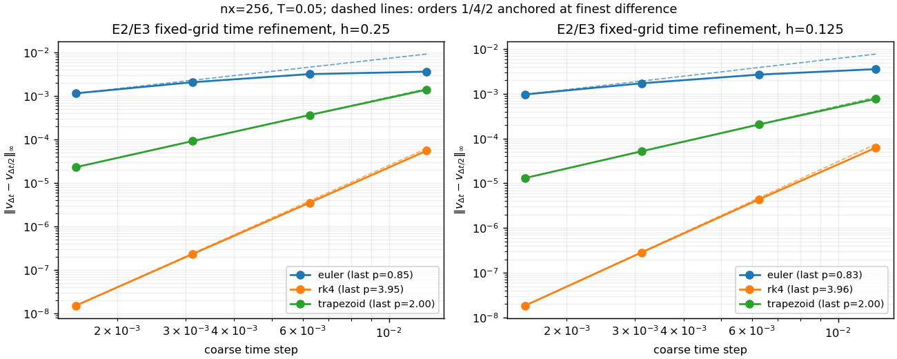
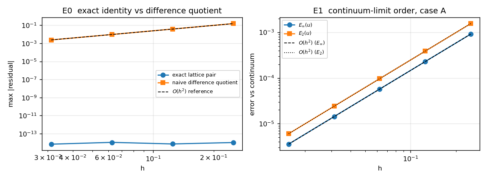
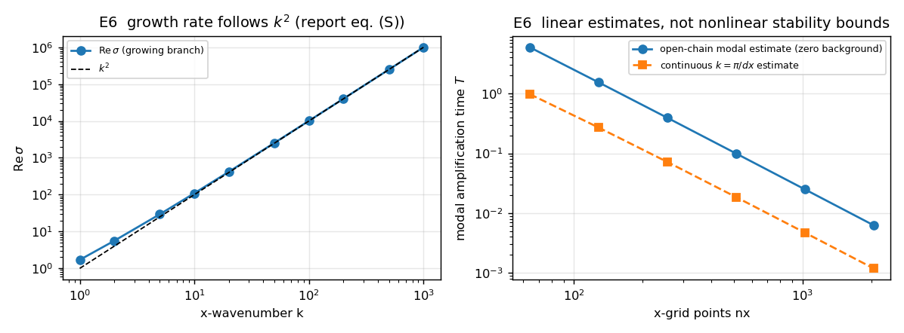
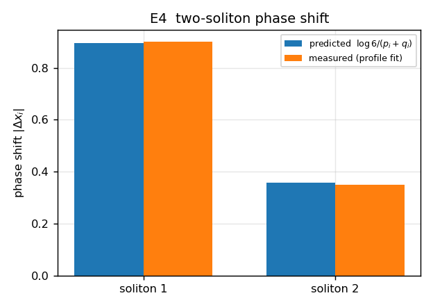

# DLW 半离散数值分析：修复后结果

2026-09-22。本文替代早期报告中关于连续参照、重构阶数和增长时间“硬限制”的错误归因。旧报告归档在 `Workspaces/numerics_review_20260922/REPORT_before_final_fixes.md`，仅供追溯。

## 当前结论

本轮四项复审问题已修复：E6 改用实际开链线性化并通过求解器测本征模；回归检查直接执行当前函数；E1 补回有限区间 x 端点权重；E5 修正格点索引、初态和周期求积。已有相位、RK 阶段、梯形失败拒绝与二阶差分修复继续有效。

本轮重跑 E1、E6、E2/E3、E5、E7；日志为 `out/final_four_fixes_log.txt`，最终 E6 日志为 `out/final_e6_log.txt`，回归为 `out/final_regressions_log.txt`。E0、N1N2、空间误差和 E4 沿用已有产物，未宣称本轮再次验收全部数学性质。Lean 的后续证明与独立验收页面已同步，见 [系统—数值—Lean 衔接记录](../lean_contracts/INTEGRATION_STATUS.md)；数值运行本身不等于形式化认证。

## 复现与证据

在本目录运行：

```powershell
python -u run_all.py e1 e6 e2e3 e2e3time e5 e7
python -u experiments/check_regressions.py
python -u make_figures.py
python -u summary.py
```

`lib/linearized.py` 给出开链线性算子；`experiments/check_regressions.py` 从当前实验源码加载函数，避免导入实验时重写 JSON。旧 JSON 的存在性检查仅为辅助，不再承担 E7 正确性验收。最终文件哈希见 `out/final_validation_manifest.json`。

## E0 / N1N2：证据边界

已有浮点双线性残差约 1e-14；高精度探针不能替代任意参数的形式化证明。N1N2 差商残差约 1e-6，含 x/t 差分截断。E0 的差商对照改变了 x/t 求导步长，不能解释成否定某个 y 离散方案。精确恒等式的理论依据另见 `../NONLINEAR_CLOSURE.md` 和 `../GRAM_INTEGRABILITY_REASSESSMENT.md`。

## E1：固定区域的连续极限

固定 y∈[-1.5,1.5]，取 F 位点 y=(j+1/2)h；x∈[-1.5,1.5] 的 25 点包含两个端点，因此采用 x 梯形权重，y 采用中点权重。L2²=dx·h·Σw_x|e|²；恒等于 1 的场得到 L2=3。旧的 2.5 阶来自区域缩小，已撤回。

| h 减半 | u 最大范数阶 | u L2 阶 |
|---|---:|---:|
| [0.25, 0.125] | 1.99584 | 2.00112 |
| [0.125, 0.0625] | 1.99772 | 2.00028 |
| [0.0625, 0.03125] | 1.99881 | 2.00007 |
| [0.03125, 0.015625] | 1.99939 | 2.00002 |

非零时间结果保存在 JSON 的 `nonzero_time` 中；相位使用 q²−p²，不使用移位后的 Q²−P²。上述数值支持测试解族在这些参数下的二阶一致性，不替代统一误差定理。

## E2/E3：有限 h 求解器

推进开链状态 P=δ₋u、W=v−δ₀u，基值与鬼点在每个时间阶段从有限 h 精确解提供。x 使用四阶周期差分，D2=D1²。误差比较有限 h 解析解，使用 dx·h 等权周期求积。

本轮重新运行 nx=256 的 Euler/RK4/梯形与 nx=128、256 空间比较。对解析解的时间误差仍被空间误差主导，不能从这些表宣布求解器自身的时间阶已经测出。E7 的四阶只针对其独立连续基线；E2/E3 自身的时间阶已由下述独立同网格实验补充验收。记录的线性模态时间只是辅助诊断，不决定某次非线性推进能否完成。

### 补充：同网格时间自收敛已实际完成

固定 nx=256、L=60、开链 j=−12..12、T=0.05 和相同解析初态/时变边界。
每种方法分别取 n=4,8,16,32,64 步，比较相邻 n 与 2n 的最终数值解，
计算 p=log₂(‖U_n−U_2n‖∞/‖U_2n−U_4n‖∞)。不减解析解，因此没有把空间误差地板算入时间误差。
检查全部演化分量 P/W 与重构分量 u/v；30 次推进均到达目标时间且无拒绝/非有限值。
下表为最后三个网格 n=16,32,64 的观测阶，完整加密历史保留在 JSON 中。

| h | 方法 | P 阶 | W 阶 | u 阶 | v 阶 |
|---|---|---:|---:|---:|---:|
| 0.25 | euler | 0.8982 | 0.9465 | 0.8334 | 0.8505 |
| 0.25 | rk4 | 3.9542 | 4.0105 | 3.9364 | 3.9461 |
| 0.25 | trapezoid | 2.0086 | 1.9930 | 2.0000 | 1.9974 |
| 0.125 | euler | 0.9474 | 0.9699 | 0.8440 | 0.8301 |
| 0.125 | rk4 | 3.9010 | 4.0699 | 3.9520 | 3.9634 |
| 0.125 | trapezoid | 2.0016 | 2.0050 | 1.9970 | 1.9957 |

六组都通过事先指定的末级观测阶与理论阶相差小于 0.35 的检查。
Euler 的粗步长尚处于渐近区前段，不能把末级值四舍五入后说成精确一阶。
这些结果支持当前有限维、短时间、指定数据上的 1/4/2 阶时间行为，不证明非线性长期稳定或一般初值收敛。
梯形法各步还须满足求解器残差容差；本实验使用 tol=1e-14、maxit=100。



数据与执行源码哈希：`out/e2_e3_self_convergence.json`；完整日志：`out/e2_e3_self_convergence_log.txt`。
复现：`python -u run_all.py e2e3time`。

## E4：解析两孤子相移

现有结果 0.900 / 0.350 对理论 0.895880 / 0.358352，来自解析 Gram 解剖面。它核验解析族，不代表数值推进已经通过散射验收。

## E5：求解器守恒检测

u/W 数组从 J_L 开始编号，现正确使用 k=MID−J_L，检测 j=0。先记录 t=0，再记录每个接受的时间步。周期 x 积分为 dx·Σ，不使用漏掉周期末段的梯形积分。成功到达目标时间、无停止原因、P/W 有限值均须通过断言。

| 方法 | dt | 最终时间 | max ΔI_W（相对初态） | max ΔI_v（相对初态） |
|---|---:|---:|---:|---:|
| rk4 | 0.0003125 | 0.005 | 1.110e-16 | 1.110e-16 |
| rk4 | 7.8125e-05 | 0.005 | 1.110e-16 | 3.331e-16 |
| euler | 7.8125e-05 | 0.005 | 2.220e-16 | 2.220e-16 |

这些短时间线性积分漂移很小，与离散空间导数的零均值结构相容。不能仅凭守恒推断解误差、长期稳定或非线性守恒量全部成立。

## E6：实际开链的线性增长

背景为零，j=-12..12；基值、u 鬼点与外侧 P 的扰动均为零，与求解器 `use_ext=True` 的固定边界扰动一致。对每个允许的周期 x 模态使用四阶符号 κ=(8sinθ−sin2θ)/(6dx)，构造全部 P/W 分量的 49×49 线性矩阵并扫描 x 模态。没有再把某个固定格点 Fourier 相位当作开链谱。

令 R 为从 P 重构 u 的累加矩阵，B 为零鬼点的中心格点导数，D 为后向差分、M 为后向平均、L 为零外侧 P 的二阶格点差分，则线性矩阵块为：

```text
A_PP = -2aiκ D R + κ²(M B R - h² L/4)
A_PW =  iκ h² D/4 + κ² M
A_WP =  4iκ R
A_WW = (-2aiκ - κ²) I
```

矩阵与实际非线性 RHS 的中心微扰导数核对，再以 ±ε 本征模运行真实 RK4，检查 Fourier 系数的增长率和完整模态形状。使用两档网格、扰动幅度和时间步。

| nx | ε | 预测 Re σ | 实测增长率 | 归一化增长率误差 | RHS 线性化误差 |
|---|---:|---:|---:|---:|---:|
| 64 | 1.0e-06 | 0.787160477 | 0.787160476 | 3.24e-10 | 9.41e-14 |
| 64 | 5.0e-07 | 0.787160477 | 0.787160477 | 2.01e-11 | 9.24e-14 |
| 128 | 1.0e-06 | 2.945660322 | 2.945660322 | 7.92e-11 | 3.69e-13 |
| 128 | 5.0e-07 | 2.945660322 | 2.945660322 | 4.93e-12 | 3.69e-13 |

增长率误差除以 max(1,|Re σ|)。本征模从同一个数值矩阵构造，因此该试验验证算子实现与短时传播一致，不是独立证明整个谱。矩阵非正规，浮点本征值可能敏感，谱横坐标按数值估计报告。另记录 μ=max eig((A+A*)/2)：在该零背景线性系统的欧氏范数中，||z(t)||≤exp(μt)||z(0)||；它仍不是孤子背景或非线性系统的稳定保证。

| nx | 数值谱横坐标 | 单模态放大 10⁶ 的时间估计 | 线性对数范数 μ |
|---|---:|---:|---:|
| 64 | 2.32038 | 5.95399 | 11.7596 |
| 128 | 8.95489 | 1.54279 | 25.7733 |
| 256 | 35.0502 | 0.394164 | 68.0833 |
| 512 | 138.7 | 0.0996074 | 228.73 |
| 1024 | 551.874 | 0.0250338 | 870.498 |
| 2048 | 2200.91 | 0.00627717 | 3438.04 |

连续色散式表仅作模型公式对照；“预算是硬约束”“细网格必然溢出且不是 bug”等旧断言全部撤回。图 2 的纵轴现为模态放大时间，不再写成可用推进时间。

## E7 与行为回归

当前 RK4 每级由当前 w 重构 u。固定边界选择已声明；测试固定空间网格上的时间自收敛，不把冻结边界误称为随时间解析边界。

| dt | v 最大误差 | 时间阶 |
|---|---:|---:|
| 0.005 | 1.963e-07 | — |
| 0.0025 | 1.351e-08 | 3.861039452508992 |
| 0.00125 | 8.985e-10 | 3.9103189860287273 |
| 0.000625 | 5.780e-11 | 3.9584025860862146 |

行为回归另以更细 T/128 参照直接执行当前源码，要求每步数正确、值有限、时间阶>3.5；重新引入漏更新错误会被这些检查捕获。E1 常数场求积、E5 指定格点与初态、E6 实际 D1 符号与本征模亦直接执行。

## 图与后续范围





此次四项修复不等于所有研究目标完成。仍可进一步开展求解器的两孤子散射、长时间误差与非线性稳定性研究；这些不作为本轮已证明或已验收结论。
